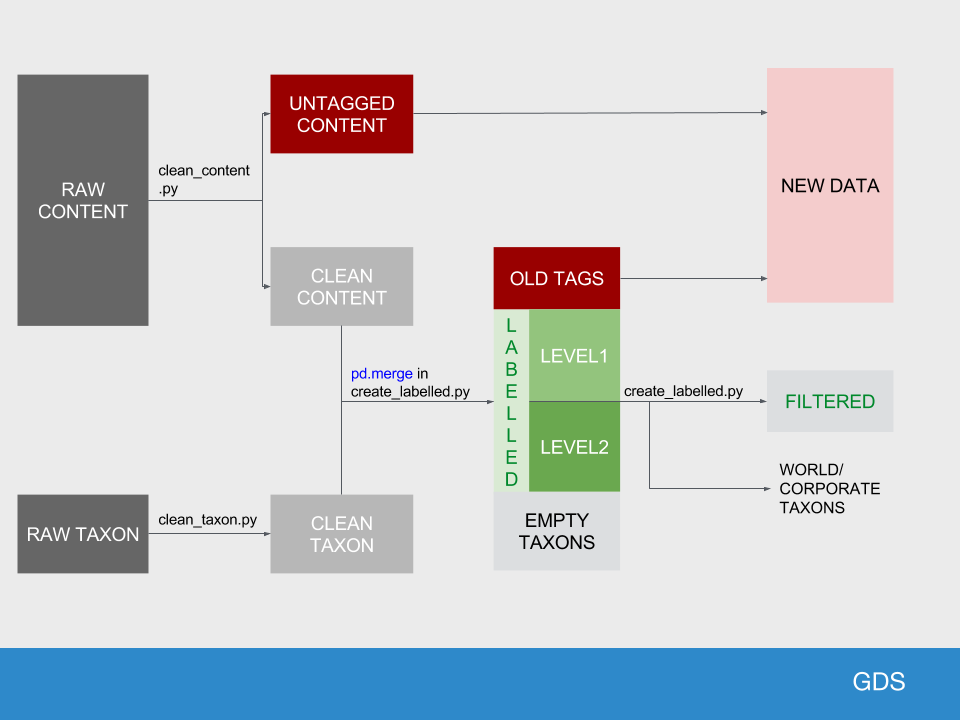

# govuk-taxonomy-supervised-machine-learning

Automatically tag content tags to taxons using machine learning algorithms.

## Requirements

* Python 3.4.6
* See [requirements.txt](requirements.txt) for python dependencies

## Setting environment variables

A number of environment variables need to be set before running the cleaning scripts on your system:

|ENV VAR|Description|Nominal value|
|---|---|---|
|DATADIR|Path to the directory storing the data|`./data` (relative to the root of the repository -- you may need to set an absolute path)|
|LOGGING_CONFIG|Path to the logging configuration file|`./python/logging.conf` (relative to the root of the repository -- you may need to set an absolute path)|
|S3BUCKET|Path of the S3 bucket in which the data are stored.|s3://buod-govuk-taxonomy-supervised-learning|

## Getting the data

The following data files are used in this project.

|Name|Location|Description|Size|
|---|---|---|---|
|raw_taxons.json|s3://buod-govuk-taxonomy-supervised-learning/raw_taxons.json|List of taxons|1.1MB|
|raw_content.json.gz|s3://buod-govuk-taxonomy-supervised-learning/raw_content.json|Content of GOV.UK (zipped to save space)|224MB|
|document_type_group_lookup.json|s3://buod-govuk-taxonomy-supervised-learning/document_type_group_lookup.json|Lookup table for document type groups|2KB|


If these files do not exist in DATADIR, they will be created by Makefile by running `make`.

The files `raw_content.json` and `raw_taxons.json` can be downloaded from the S3 bucket where they are stored using the `aws s3 cp` command. This command works exactly like the bash `cp`, e.g.: to copy a file from the s3 bucket to your local machine:

```
aws s3 cp s3://buod-govuk-taxonomy-supervised-learning/<file> <local file>
```

To copy a local file to the s3 bucket, use:

```
aws s3 cp s3://buod-govuk-taxonomy-supervised-learning/<file> <local file>
```

__NOTE: The s3 bucket is version controlled, so you do not need to rename the files to reflect the date files were produced. Just overwrite the existing file with the same filename.__

Some files are stored compressed like `raw_content.json.gz`. Do not decompress these files, as the data cleaning scripts will load the data from the compressed files automatically.

## Running the cleaning scripts

There is a Makefile which can be run to execute the cleaning scripts. After downloading the data to an appropriate dir, and pointing at it with the env vars, you can install python dependencies by running `make init`.

Once complete, running `make` will launch the cleaning scripts, creating a number of files:

|Filename (data/)|produced by (python/)|
|---|---|
|clean_taxons.csv|clean_taxons.py|
|clean_content.csv|clean_content.py|
|untagged_content.csv|clean_content.py|
|empty_taxons.csv|create_labelled.py|
|labelled.csv|create_labelled.py|
|filtered.csv|create_labelled.py|
|old_taxons.csv|create_labelled.py|
|empty_taxons.csv|create_labelled.py|
|labelled_level1.csv|create_labelled.py|
|labelled_level2.csv|create_labelled.py|
|empty_taxons_not_world.csv|create_labelled.py|
|new_content.csv|create_new.py|
    
The following schematic describes the movement of data through the pipeline, and the role of each of the scripts.



The cleaned files are used by the python notebooks contained in `python/notebooks`.

## Jupyter notebooks

### Setting up a Jupyter kernal

You should use your virtualenv when running jupyter notebooks. Follow the following steps:

Install the ipython kernel module into your virtualenv
```{bash}
workon my-virtualenv-name  # activate your virtualenv, if you haven't already
pip install ipykernel
```

Now run the kernel "self-install" script:
```{bash}
python -m ipykernel install --user --name=my-virtualenv-name
```

Replacing the --name parameter as appropriate.

You should now be able to see your kernel in the IPython notebook menu: Kernel -> Change kernel and be able so switch to it (you may need to refresh the page before it appears in the list). IPython will remember which kernel to use for that notebook from then on.

### Notebooks
|Name|Activity|Data inputs|Data outputs|
|---|---|---|---|
|EDA-count-data|Read in and count data files|untagged_content.csv, clean_taxons.csv, clean_content.csv.gz, labelled.csv, filtered.csv, empty_taxons.csv, old_tags.csv|None|
|EDA-taxons|Descriptive analysis of taxon content overall, and according to level|labelled, filtered, taxons|level2taxons_concordant.csv, taggedtomorethan10taxons.csv|
|EDA-document-type|Descriptive analysis of content according to document type, over time|untagged, labelled, filtered, labelled_level1, labelled_level2|document_type_group_lookup.json|
|EDA-other-metadata|Descriptive analysis of content according to metadata types, over time|untagged, labelled, filtered, labelled_level1, labelled_level2|none|

## Machine learning notebooks (ML_notebooks)
|Name|Activity|Data inputs|
|---|---|---|
|CNN-allgovuk.ipynb|Convolutional Neural Network of tagged content using keras framework and pre-trained word embeddings|clean_content.csv.gz, clean_taxons.csv|
|SVM_allgovuk.ipynb|Support vector machine of tagged content||
|TPOT_allgovuk.ipynb|Genetic algorithm to select optimal algorithm and hyperparameters||

## Archived notebooks
|Name|Activity|Data inputs|Data outputs|
|---|---|---|---|
|EDA|Exploratory data analysis|untagged_content.csv, clean_taxons.csv, clean_content.csv.gz|None|
|clean_content.ipynb|Development of steps to process raw content data into formats for use in EDA and modelling. These are now used in clean_content.py, which is called by the Makefile|||
|explore_content_dupes.ipynb|Understand duplicates in gov.uk content items|raw_content.json, clean_content.csv|None|

## Logging

The default logging configuration (set in `./python/`) will do the following things:

* Write a simple log to stdout (console) at `INFO` level
* Write a more detailed log to a file at `DEBUG` level (by default `/tmp/govuk-taxonomy-supervised-learning.log`).

