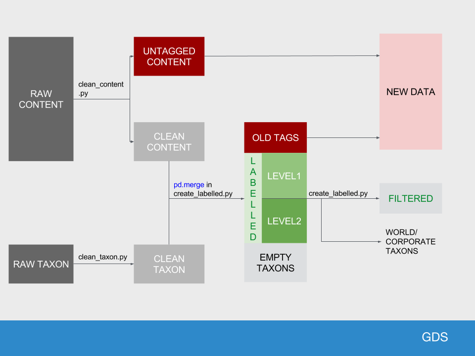

# govuk-taxonomy-supervised-machine-learning notebooks

Python notebooks to automatically tag content tags to taxons using machine learning algorithms.

## Requirements

* Python 3.4.6
* See [requirements.txt](requirements.txt) for python dependencies

## Jupyter kernal
You can use a virtualenv for your IPython notebook. Follow the following steps:

Install the ipython kernel module into your virtualenv
```{bash}
workon my-virtualenv-name  # activate your virtualenv, if you haven't already
pip install ipykernel
```

Now run the kernel "self-install" script:
```{bash}
python -m ipykernel install --user --name=my-virtualenv-name
```

Replacing the --name parameter as appropriate.

You should now be able to see your kernel in the IPython notebook menu: Kernel -> Change kernel and be able so switch to it (you may need to refresh the page before it appears in the list). IPython will remember which kernel to use for that notebook from then on.

## Getting the data


See README at root of repo


## Notebooks
|Name|Activity|Data inputs|Data outputs|
|---|------|---|---|
|EDA-count-data|Read in and count data files|untagged_content.csv, clean_taxons.csv, clean_content.csv.gz, labelled.csv, filtered.csv, empty_taxons.csv, old_tags.csv|None|
|EDA-taxons|Descriptive analysis of taxon content overall, and according to level|labelled, filtered, taxons|level2taxons_concordant.csv, taggedtomorethan10taxons.csv|
|EDA-document-type|Descriptive analysis of content according to document type, over time|untagged, labelled, filtered, labelled_level1, labelled_level2|document_type_group_lookup.json|

EDA-other-metadata|Descriptive analysis of content according to metadata types, over time|untagged, labelled, filtered, labelled_level1, labelled_level2|none|

|EDA|Exploratory data analysis|untagged_content.csv, clean_taxons.csv, clean_content.csv.gz|None|
|CNN-allgovuk.ipynb|Convolutional Neural Network of tagged content using keras framework and pre-trained word embeddings|clean_content.csv.gz, clean_taxons.csv||
|SVM_allgovuk.ipynb|Support vector machine of tagged content|||
|TPOT_allgovuk.ipynb|Genetic algorithm to select optimal algorithm and hyperparameters|||
|clean_content.ipynb|Development of steps to process raw content data into formats for use in EDA and modelling. These are now used in clean_content.py, which is called by the Makefile|||
|explore_content_dupes.ipynb|Understand duplicates in gov.uk content items|raw_content.json, clean_content.csv|None|


